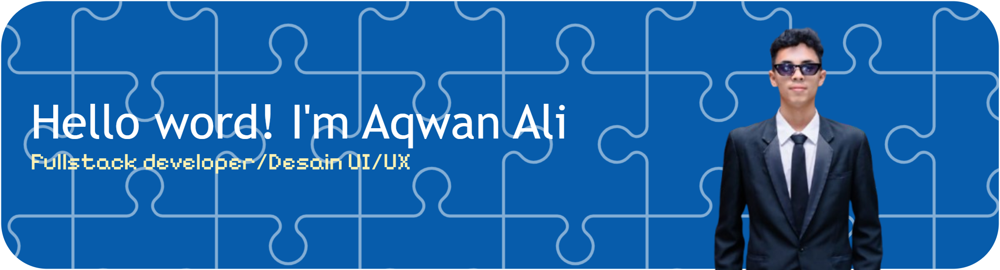

- 🔭 I’m currently working on web development projects and expanding my portfolio.
- 🌱 I’m currently learning **Backend Development & Database Design**.
- 👥 I’m open to collaboration on Frontend projects or open-source initiatives.
- ⚡ Fun fact: I enjoy exploring IoT microcontrollers and UI/UX design trends in my spare time.

##### Skills

##### Connect with me

   

##### My Github stats

<h4 align="left">Play Game With Me</h4>

###

<picture>
  <source media="(prefers-color-scheme: dark)" srcset="https://raw.githubusercontent.com/<h1 align="left">Hello word</h1>  
###  
I'm Aqwan Ali Daud
  
###  <h2 align="left">About me</h2>  
###  
Fullstack Developet
  
###  <h2 align="left">I code with</h2>  
###  
                                                          
  
###/<h1 align="left">Hello word</h1>  
###  
I'm Aqwan Ali Daud
  
###  <h2 align="left">About me</h2>  
###  
Fullstack Developet
  
###  <h2 align="left">I code with</h2>  
###  
                                                          
  
###/pacman-output/pacman-contribution-graph-dark.svg">
  <source media="(prefers-color-scheme: light)" srcset="https://raw.githubusercontent.com/<h1 align="left">Hello word</h1>  
###  
I'm Aqwan Ali Daud
  
###  <h2 align="left">About me</h2>  
###  
Fullstack Developet
  
###  <h2 align="left">I code with</h2>  
###  
                                                          
  
###/<h1 align="left">Hello word</h1>  
###  
I'm Aqwan Ali Daud
  
###  <h2 align="left">About me</h2>  
###  
Fullstack Developet
  
###  <h2 align="left">I code with</h2>  
###  
                                                          
  
###/pacman-output/pacman-contribution-graph.svg">
  Hello word</h1>  
###  
I'm Aqwan Ali Daud
  
###  <h2 align="left">About me</h2>  
###  
Fullstack Developet
  
###  <h2 align="left">I code with</h2>  
###  
                                                          
  
###/<h1 align="left">Hello word</h1>  
###  
I'm Aqwan Ali Daud
  
###  <h2 align="left">About me</h2>  
###  
Fullstack Developet
  
###  <h2 align="left">I code with</h2>  
###  
                                                          
  
###/pacman-output/pacman-contribution-graph.svg">
</picture>

###